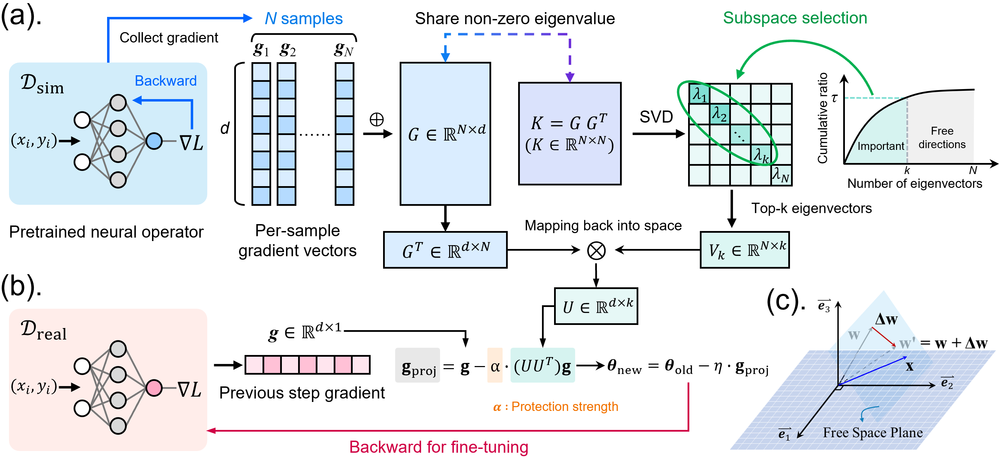

# PhysGuard

Code for **PhysGuard: Fisher-Guided Gradient Projection for Sim-to-Real Neural PDE Surrogates**.

PhysGuard preserves the physics learned during simulation pre-training when adapting
a neural PDE surrogate to real experimental data. It uses the empirical Fisher
Information Matrix (FIM) of the pre-trained model to identify the parameter
directions that encode low-frequency physical structure, and then constrains
fine-tuning gradients to the **null space** of those directions. The whole
procedure adds no penalty term, no extra trainable module, and only one
hyperparameter — the protection strength `α`.

<p align="center">
  
</p>

## 📖 Method at a glance

Given a pre-trained neural operator `f_θ*` and a small batch of `N` simulation
gradients `g_i = ∇_θ ℓ(θ*; x_i, y_i)` stacked into `G ∈ R^{N×d}`:

1. **Subspace estimation (offline, once).** For every layer `m`, build the
   Gram matrix `K = G Gᵀ ∈ R^{N×N}`, run an SVD, keep the smallest `k_m`
   eigenvectors that capture `τ` (default `0.9`) of the cumulative Fisher
   variance, and lift them back to parameter space:

   ```
   U^(m) = normalise( Gᵀ V_{k_m} ) ∈ R^{d×k_m}
   ```

2. **Constrained fine-tuning (every step).** During real-data fine-tuning,
   project each per-layer gradient onto the safe subspace before the
   optimiser step:

   ```
   g_proj = g − α · U Uᵀ g          (α = 1.0 ⇒ full null-space projection)
   ```

The two functions are implemented in [`physguard/projector.py`](physguard/projector.py)
(subspace estimation) and [`physguard/optimizer.py`](physguard/optimizer.py)
(per-step gradient projection wrapper around any `torch.optim.Optimizer`).

## 🗂 Repository layout

```
.
├── physguard/                       core algorithm (≈ 800 LOC)
│   ├── projector.py                 NullSpaceProjector — Gram-trick FIM SVD
│   ├── optimizer.py                 NullSpaceOptimizer — gradient-projection wrapper
│   └── train.py                     entry point: `python -m physguard.train`
├── realpdebench/                    benchmark engine (data loaders, models, eval)
│   ├── train_surrogate.py           pre-training & baseline fine-tuning entry
│   ├── eval.py                      evaluation entry
│   ├── model/                       FNO, CNO, DeepONet, Transolver, ...
│   ├── data/                        HF Arrow + HDF5 dataset wrappers
│   └── utils/                       metrics, normalisers, helpers
├── configs/                         YAML configs (4 archs × 5 paradigms × 3 scenarios)
│   ├── 1-cylinder/
│   │   ├── fno/
│   │   │   ├── 1_pretrain.yaml      ← Step 1: train on simulation
│   │   │   ├── 2_dft.yaml           ← Step 2 options (pick one)
│   │   │   ├── 2_ewc.yaml
│   │   │   ├── 2_l2sp.yaml
│   │   │   └── 2_physguard.yaml
│   │   ├── cno/  deeponet/  transolver/  (same layout)
│   ├── 2-controlled_cylinder/  (same layout)
│   └── 3-combustion/           (same layout)
├── figures/                         method overview & motivation
├── pyproject.toml                   pip-installable package (`pip install -e .`)
└── environment.yml                  conda environment
```

## ⚙️ Requirements

Python ≥ 3.10, CUDA ≥ 11.8, one GPU (A40 / A100 / 4090 sufficient for FNO/CNO/DeepONet/Transolver on the cylinder and combustion scenarios).

```bash
pip install -e .
```

A reference conda environment is provided in `environment.yml`. The core
PhysGuard module only depends on `torch` and `tqdm`; the rest of the stack
(`huggingface-hub`, `datasets`, `einops`, `pytorch-wavelets`, …) is required by
the benchmark loaders and baseline architectures.

## 📥 Data and pre-trained backbones

The experiments use [RealPDEBench](https://huggingface.co/datasets/AI4Science-WestlakeU/RealPDEBench),
which provides paired numerical and real-world trajectories.

```bash
# Metadata only (safe default)
realpdebench download --dataset-root ./data/realpdebench --scenario cylinder --what metadata

# Full HF Arrow shards (large, use --endpoint hf-mirror if needed)
realpdebench download --dataset-root ./data/realpdebench --scenario cylinder \
    --what hf_dataset --dataset-type real     --endpoint https://hf-mirror.com
realpdebench download --dataset-root ./data/realpdebench --scenario cylinder \
    --what hf_dataset --dataset-type numerical --endpoint https://hf-mirror.com
```

Pre-trained simulation backbones for every (architecture × scenario)
combination are released at
[`AI4Science-WestlakeU/RealPDEBench-models`](https://huggingface.co/AI4Science-WestlakeU/RealPDEBench-models):

```python
from huggingface_hub import hf_hub_download
ckpt = hf_hub_download(
    repo_id="AI4Science-WestlakeU/RealPDEBench-models",
    filename="cylinder/fno/numerical.pth",      # used as the sim-to-real starting point
)
```

After download, edit the `dataset_root` and `checkpoint_path` fields in the
relevant YAML config (or override on the command line).

## 🚀 Quick Start

The PhysGuard algorithm and three baseline fine-tuning protocols share one
unified hyperparameter set so the results are directly comparable. We use
**`1-cylinder × FNO`** as the running example — replace
`1-cylinder` with `{1-cylinder, 2-controlled_cylinder, 3-combustion}` and `fno` with `{fno, cno, deeponet, transolver}`.

### 1️⃣  Pre-train on simulation data (skip if using released backbones)

```bash
python -m realpdebench.train_surrogate \
    --config configs/1-cylinder/fno/1_pretrain.yaml \
    --train_data_type numerical
```

Results are written to `<results_path>/<model>/<exp_name>_pretrained/<timestamp>/`,
including `model_<step>.pth` checkpoints and tensorboard logs. The final
checkpoint is the input to step 2.

### 2️⃣  PhysGuard sim-to-real adaptation (this work)

```bash
python -m physguard.train \
    --config configs/1-cylinder/fno/2_physguard.yaml \
    --checkpoint_path /path/to/pretrained.pth
```

Argument explanation:

| Flag                       | Meaning                                                                            | Default |
|----------------------------|------------------------------------------------------------------------------------|---------|
| `--config`                 | YAML with shared training hyperparameters (lr, batch, scenario, model, …)          | —       |
| `--checkpoint_path`        | Path to the simulation-pretrained checkpoint                                       | —       |
| `--ns_variance_threshold`  | Adaptive `k` per layer — keep top eigenvectors covering this Fisher fraction (`τ`) | `0.9`   |
| `--ns_n_components`        | Hard cap on `k` when adaptive selection is on                                      | `200`   |
| `--ns_alpha`               | Projection strength `α` (`1.0` = full null-space projection, `0.0` = vanilla FT)   | `1.0`   |
| `--ns_max_samples`         | # simulation samples used to estimate the empirical FIM                            | `200`   |
| `--ns_protected_layers`    | Comma-separated substrings of parameter names to protect (default = all)           | `None`  |
| `--ns_progressive`         | Linearly relax `α` towards `--ns_beta_min` over training                           | `False` |

Phase 1 (FIM SVD) prints a per-layer summary like:

```
[layer fc.weight]  d=4096   N=200  -> k=18  (τ=0.90, ratio=18/200)
```

Phase 2 then runs standard fine-tuning with the projected gradient. The
adapted model is saved under `<results_path>/<model>/<exp_name>_nsft/<timestamp>/`.

### 3️⃣  Baseline fine-tuning protocols

For fair comparison, the three baselines share **identical optimiser, batch
size, learning rate, and number of update steps** with PhysGuard.

```bash
# (a) Direct Fine-Tuning (DFT)
python -m realpdebench.train_surrogate \
    --config configs/1-cylinder/fno/2_dft.yaml \
    --train_data_type real --is_finetune \
    --checkpoint_path /path/to/pretrained.pth

# (b) Elastic Weight Consolidation (EWC, Kirkpatrick et al. 2017)
python -m realpdebench.train_surrogate \
    --config configs/1-cylinder/fno/2_ewc.yaml \
    --train_data_type real --is_finetune \
    --checkpoint_path /path/to/pretrained.pth

# (c) L2-SP regularisation (Li et al. 2018)
python -m realpdebench.train_surrogate \
    --config configs/1-cylinder/fno/2_l2sp.yaml \
    --train_data_type real --is_finetune \
    --checkpoint_path /path/to/pretrained.pth
```

EWC- and L2-specific knobs (`reg_type`, `reg_lambda`, `ewc_num_samples`) are
already filled in the `*_ewc.yaml` / `*_l2sp.yaml` configs.

### 4️⃣  Evaluation

```bash
python -m realpdebench.eval \
    --config configs/1-cylinder/fno/2_physguard.yaml \
    --checkpoint_path /path/to/adapted.pth
```

Outputs the 9 RealPDEBench metrics (RMSE, MAE, Rel L₂, R², Update Ratio, fRMSE, FE, KE, MVPE).
Per the manuscript, we report **Rel L₂** (overall accuracy) and **Low-f / Mid-f / High-f RMSE** (frequency-band fidelity).

### 5️⃣  Evaluate all five methods

Replace `<paradigm>` with the method name to evaluate:

| Method | Config suffix | Entry point |
|---|---|---|
| Pretrained (zero-shot) | `fno/1_pretrain.yaml` | `realpdebench.eval` |
| DFT | `fno/2_dft.yaml` | `realpdebench.train_surrogate` + `realpdebench.eval` |
| EWC | `fno/2_ewc.yaml` | `realpdebench.train_surrogate` + `realpdebench.eval` |
| L2-SP | `fno/2_l2sp.yaml` | `realpdebench.train_surrogate` + `realpdebench.eval` |
| **PhysGuard** | `fno/2_physguard.yaml` | `physguard.train` + `realpdebench.eval` |

## 📁 Output structure

Each run produces:

```
results/<scenario>/<model>/<exp_name>_<paradigm>/<timestamp>/
├── args.txt                 dump of all CLI / YAML args (for reproducibility)
├── train.log                training log
├── tb/                      tensorboard logs
├── model_<step>.pth         periodic checkpoints
├── projection.pt            (PhysGuard only) cached FIM SVD output
└── eval/                    metric tables and qualitative plots
```

`<paradigm>` is one of `pretrained` (zero-shot), `dft`, `ewc`, `l2sp`, `physguard`.

## 🧩 Using PhysGuard in your own pipeline

Two lines integrate PhysGuard into an existing PyTorch training loop:

```python
from physguard import NullSpaceProjector, NullSpaceOptimizer

projector = NullSpaceProjector(variance_threshold=0.9, alpha=1.0)
projector.compute_projection(model, sim_dataloader, max_samples=200)

opt = NullSpaceOptimizer(torch.optim.Adam(model.parameters(), lr=1e-4),
                         model, projector)

for x, y in real_dataloader:
    loss = model.train_loss(x, y).mean()
    loss.backward()
    opt.step()           # projects gradients onto null(U^(m)) before stepping
    opt.zero_grad()
```

The projector is architecture-agnostic and supports complex-valued spectral
weights (e.g. FNO) by splitting real/imaginary parts. See `physguard/projector.py`
for the Gram-trick implementation and complex-handling logic.

## 🙏 Acknowledgement

The dataset, training pipeline, and baseline architectures are built on top
of [RealPDEBench](https://github.com/AI4Science-WestlakeU/RealPDEBench)
(ICLR 2026 Oral). The null-space projection idea is inspired by
[GPM (ICLR 2021)](https://openreview.net/forum?id=3AOj0RCNC2) and
[AlphaEdit (ICLR 2025)](https://github.com/jianghoucheng/AlphaEdit), which
develop similar geometric protection mechanisms in different settings.

## 📜 License

The PhysGuard additions (`physguard/`, `figures/`, top-level configs and
README) are released under the **MIT** license (`LICENSE`). The benchmark
code in `realpdebench/` is governed by `LICENSE.RealPDEBench` (CC BY-NC 4.0).
